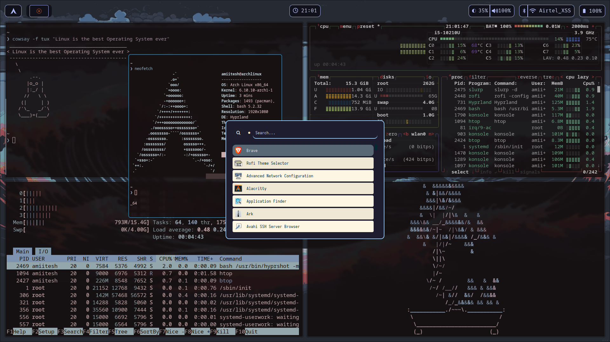

 
  
# Arch Hyprland Dotfiles 

# Application

-   **Distro**: [Arch](https://archlinux.org)
-   **Window manager**: [hyprland](https://github.com/hyprwm/Hyprland)
-   **Top bar**: [waybar](https://github.com/Alexays/Waybar)
-   **Terminal**: [Konsole](https://github.com/KDE/konsole)
-   **Text editor**: [nvim](https://github.com/neovim/neovim)
-   **File manager**: [Dolphin](https://github.com/KDE/dolphin)
-   **Application opener**: [rofi](https://github.com/davatorium/rofi)
-   **Web browser**: [FireFox](https://www.mozilla.org/en-US/firefox/windows/)
-   **Visual candy**: [cbonsai](https://github.com/hortinstein/cbonsai)
-   **Shell**: [fish](https://github.com/fish-shell/fish-shell)
-   **Bash Prompt**: [Starship Tokyo_night](https://starship.rs/)
